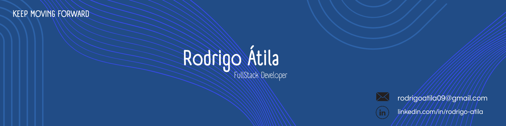

  

---

<b>About Me</b>

  
    Hi, I'm Rodrigo! I'm a Software Engineering student at the University of Brasília (UnB). 
    I focus on building technology-driven solutions that simplify daily life and create 
    a positive impact on people. This is what drives me as a developer.
  

---

## Stack

### Languages

### Frameworks & Tools

---

## Main Repositories

  <table border="0" cellpadding="0" cellspacing="0" width="70%">
    <tr>
      <td width="50%" align="center" valign="middle">
        
      </td>
      <td width="50%" align="center" valign="middle">
        
      </td>
    </tr>
  </table>

---

## Stats

  
  

---

## Connect with me

  
  &nbsp;&nbsp;&nbsp;
  
  &nbsp;&nbsp;&nbsp;
  

